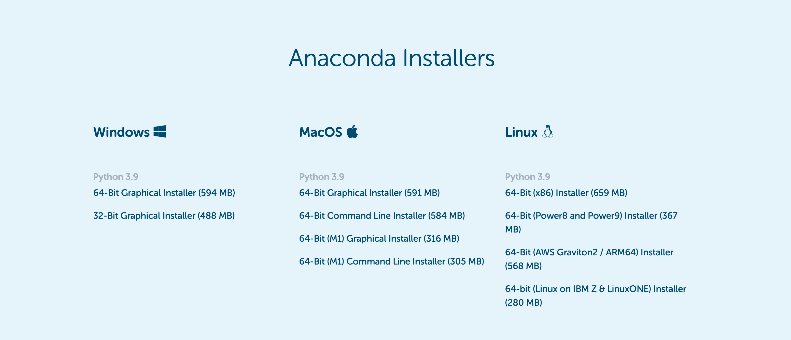
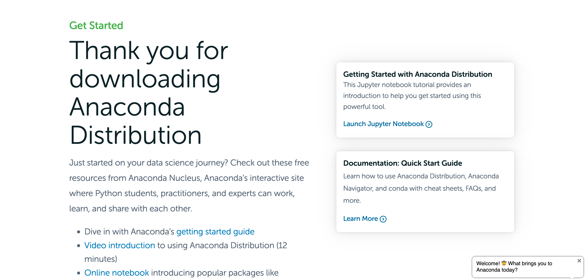
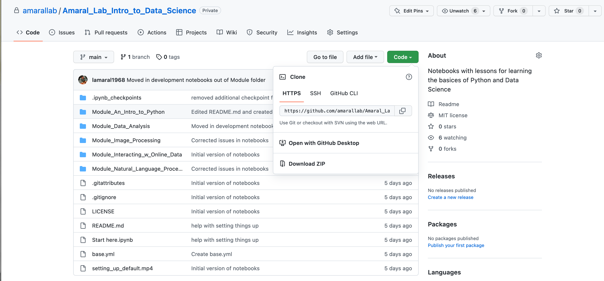
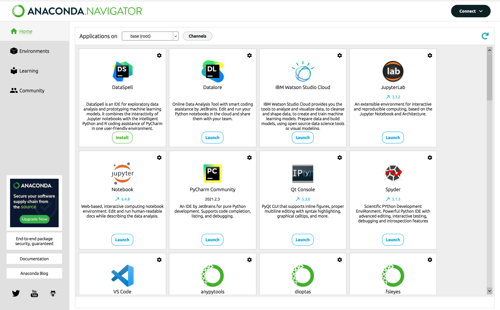

These materials constitute the textbook for NICO 101/401 - Introduction to Programming for Big Data.
This course will teach you the basics of programming in Python, visualizing data, and web-scraping 
as well as analyzing unstructured text, structured data, and images. 

This course does not explicitly use any 'big' datasets during the quarter, what it does do is teach
you the fundamentals of programming and analysis that can then be scaled to any size data. As a part
of this we will discuss the basics of statistical analysis and how that can be applied to datasets.

Any comments, questions, or concerns can be directed to:

* Luis A.N. Amaral <amaral@northwestern.edu>
* Adam R. Pah <adamrpah@gmail.com>
* Helio Tejedor <heltena@northwestern.edu>

# Software and Hardware requirements

If  you want to use these lessons, you should that you have a relatively modern operating system. 

For Windows, you must be using Windows 7 or later.

For Mac, you must be using OS X 10.9 or later.

**You must have a Python distribution installed before you can start work with the notebooks we prepared.** 

**If you are taking NICO 101/401, you need to have the Python distribution installed by the first day of class!**

# Installing Anaconda's Python Distribution

We strongly recommend that you use install [Anaconda's Python distribution](https://www.anaconda.com/products/distribution#Downloads).

If you click on the above link, it will see the following page.

Choose the appropriate option for your computer and operating system.

After you click on the appropriate option and start the download, your browser will be directed to [this page](https://www.anaconda.com/products/distribution/download-success-2).

**If you already have Anaconda installed in your system, the Installer will not work and will instruct you to use `conda` to update your system instead.** 

# Downloading the Course's Materials

The course materials can be downloaded from the repository's [github page](http://github.com/amarallab/Amaral_Lab_Intro_to_Data_Science):

If you click on the green button titled `Code` you will reveal an option to download a `ZIP` file with the entire repository.  

Choose that option!

Then, unzip the file in your `Desktop`, or even better, in your `Dropbox`, `Box`, or `OneDrive` folder.  If you do the later, you will be having it backed up and accessible anywhere!

You can then rename the folder `Amaral_Lab_Intro_to_Data_Science`, `NICO-101`, or whatever you feel like.

     
# Jupyter Lab

We will be making extensive use of the [Jupyter](https://jupyter.org/) environment. `Jupyter Lab` is a 'web-based interactive computational environment', meaning that it allows to write and execute python code in a web page from your own computer. `Jupyter Lab` is an excellent environment in which learn the basics of Python programming and computational data analysis.

`Jupyter Lab` is installed by default with the Anaconda Python distribution and can be launched from the `Anaconda Navigator` program. We have another video below that details how to launch and use a notebook.

**Find the `Anaconda Navigator` application in your computer and launch it.**

If you click on the `Notebook` application (second row, first on the left in image) you will launch the a `Jupter Lab` instance. in your browser of choice.

**Navigate to the folder where you placed the course materials and click on `Start here.ipynb` file to open it.**

# Acknowledgements

This incarnation of the course builds on [Introduction to Python Programming and Data Science](https://github.com/amarallab/Introduction-to-Python-Programming-and-Data-Science), which will no longer be maintained. *Introduction to Python Programming and Data Science* was been built through the efforts of many that have served as teaching assistants and lecturers in the 
many iterations of the course. We would like to thank (in alphabetical order):

* Alessandro Febretti
* Justin Finkle
* Adam Hockenberry
* H. Ada Lee
* Jeff Lunt
* Joao Moreira
* Jackie Milhans
* Aaron Oppenheimer
* Nick Timkovich
* Max Wasserman
* Peter Winter
* Jia Wu

The new version, build on the work of all of these and on additional contributions by:

* Luiz Gustavo de Andrade Alves
* Helio Tejedor
  